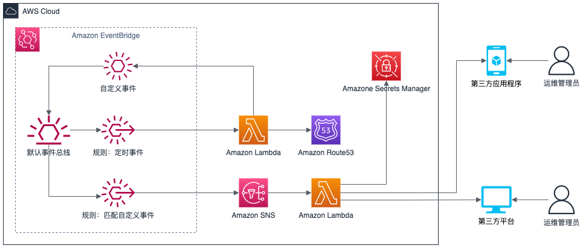

# Route53 注册域名到期时间主动通知

## 前期工作

- 注册企业微信、获取相应的企业id、应用id及应用key
- 根据AWS博客[链接](https://www.amazonaws.cn/solutions/serverless-alert-notifier/)，部署无服务SNS通知堆栈
- 建议部署在us-east-1区域，访问Route53服务设置访问Region为us-east-1
- 部署完成后，堆栈会创建两个个规则，对于Health Dashboard的事件以及EC2的启停事件的监控，可以通过启动或停止一台EC2测试通知是否可以正确发送

## 整体架构



- 通过Amazon EventBridge创建定时事件，定时触发lambda到Route53获取所有将要在所选时间内的过期的域名
- 将所选的域名组织为作为自定义事件的详细信息发送的默认事件总线
- 创建个规则匹配自定义事件，触发Amazon SNS调用lambda，将相关信息通过第三方平台发送到第三方应用程序

## 部署流程

### 按计划触发lambda

- 进入lambda控制台

- 选择函数菜单并点击创建函数

- 选择从头开始创作，输入函数名，如*domain-schedule-check*，运行时选择*Python3.9*，选择使用arm64架构并点击创建

- 点击添加触发器

- 选择EventBridge为触发器，创建新规则，输入规则名称如*domain-schedule-check-rule*，输入计划表达式如:*cron(0 2 * * ? *)*，为每天早上触发

- 选择代码项，并将[相应代码](https://raw.githubusercontent.com/turmind/route53domain-check-expire/main/main.py)复制到*lambda_function.py*，如有需要，可进行相应的调整，并点击Deploy

- 选择配置项并选择环境变量，添加环境变量*Expire_Notify_Day*，变量值为域名在多长时间内过期前发送消息通知

- 选择权限，并通过角色名称跳转到相应角色页面添加权限策略

- 通过添加权限中的附加策略，添加*AmazonRoute53DomainsReadOnlyAccess*及*AmazonEventBridgeFullAccess*策略


### 创建匹配自定义事件的个规则

- 从控制台选择进入Amazon EventBridge

- 选择个规则并选择创建规则

- 输入个规则名称如：*domain-check-notify*，选择默认事件总线*default*，选择具有事件模式的规则

- 在事件模式中，使用自定义模式，输入匹配json


```json
{
  "source": ["Route53Domain.Expire.Notify"],
  "detail-type": ["Route53 Domain Expire Notify"]
}
```

- 选择SNS主题作为目标，选择前期工作中通过CloudFormation创建的主题

- 点开其他设置，选择已匹配的部分事件并输入*$.detail.domains*

- 最后创建个规则

### 测试

- 回到刚才创建的lambda函数中，点击测试按钮，此时可以收到相应的消息通知


## 其他

- 通过EventBridge的个规则中，可以调整计划标准规则的触发时间，如示例中是每天上午十点发送消息通知，改为每周一或者其他时间发送

## 参考

[无服务器告警推送解决方案](https://www.amazonaws.cn/solutions/serverless-alert-notifier/)

[实现代码](https://github.com/turmind/route53domain-check-expire)

[规则的计划时间表达式](https://docs.aws.amazon.com/eventbridge/latest/userguide/eb-create-rule-schedule.html)